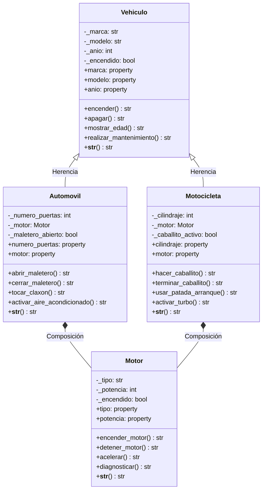

# Sistema de Gestión de Vehículos - POO en Python

## Descripción
Sistema orientado a objetos que implementa herencia, encapsulamiento, composición y métodos de comportamiento para gestionar vehículos (automóviles y motocicletas).

## Conceptos Aplicados
- ✅ **Encapsulamiento**: Atributos privados con `@property` y `@setter`
- ✅ **Herencia**: Clases `Automovil` y `Motocicleta` heredan de `Vehiculo`
- ✅ **Composición**: Uso de la clase `Motor` dentro de vehículos
- ✅ **Polimorfismo**: Sobrescritura del método `__str__()`
- ✅ **Métodos de Comportamiento**: Múltiples métodos por clase

## Diagrama UML


## Estructura de Clases

### Motor (Composición)
- **Atributos**: tipo, potencia
- **Métodos**: encender_motor(), detener_motor(), acelerar(), diagnosticar()

### Vehiculo (Superclase)
- **Atributos**: marca, modelo, año
- **Métodos**: encender(), apagar(), mostrar_edad(), realizar_mantenimiento()

### Automovil (Hereda de Vehiculo)
- **Atributo adicional**: número_puertas
- **Composición**: Motor
- **Métodos**: abrir_maletero(), tocar_claxon(), activar_aire_acondicionado()

### Motocicleta (Hereda de Vehiculo)
- **Atributo adicional**: cilindraje
- **Composición**: Motor
- **Métodos**: hacer_caballito(), usar_patada_arranque(), activar_turbo()

##  Ejecución
```bash
python VEHICULOS_POO.PY
```

pa- `README.md` - Documentación del proyecto
- `Captura.PNG` - Captura de pantalla de la ejecución
